机器学习发展至今涵盖的内容已经非常多，本文通过对其使用情景、任务和方法分类在上文的基础上对机器学习做进一步的介绍。

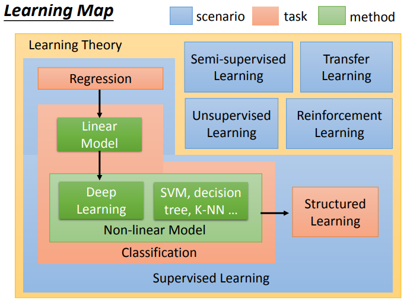

### 监督学习(Supervised Learning)

上文曾提到机器学习可以看成是从数据中找到一个函数。对于回归(Regression)这类任务而言，我们希望得到的函数的输出值是数值(Scalar)，而不是像之前图像识别一样输出类别。

举例来说，我们需要预测PM2.5值。

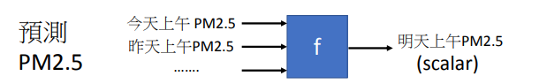

对于回归这类任务而言，我们可以选择适用的模型，将训练数据丢给它，

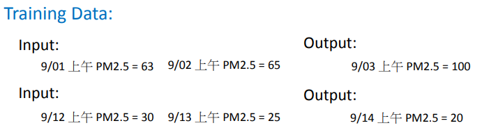

用以得到最优的函数。

监督学习中还有一种叫做分类(Classification)的任务，与回归不同，分类任务希望得到函数的输出是类别。它可以分为二分类问题和多分类问题。

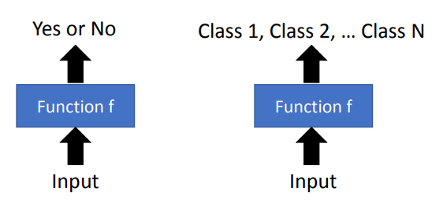

比如，垃圾邮件过滤(Spam Filtering)，即判断一封邮件是否为垃圾邮件就是一个二分类问题。

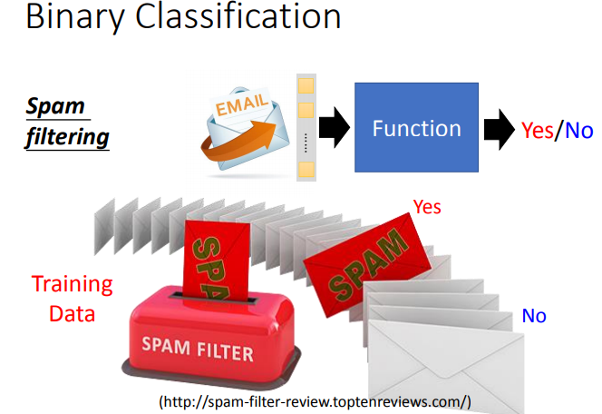

而文档分类(Document Classification)，根据文档内容将其归类为政治、经济、体育等类别就是一个多分类问题。

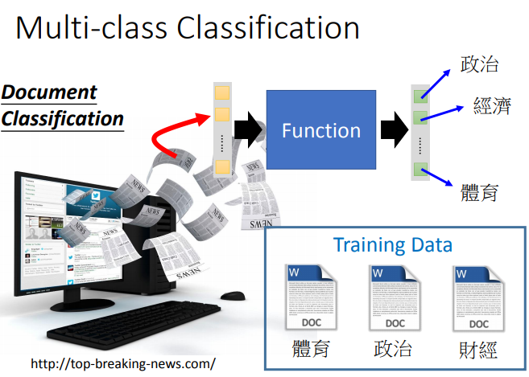

还有很多分类任务的例子，比如：

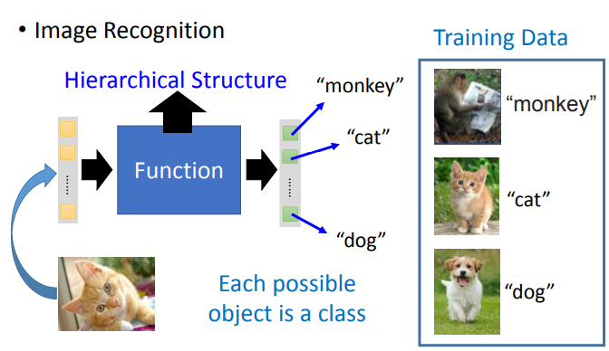

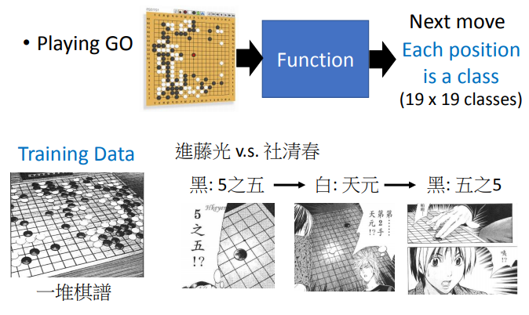

在每种任务中，我们都可以采用各种适用于该任务的模型。比如，线性模型(Linear Model)和非线性模型(Non-linear Model)。

- 线性模型能力有限，一些简单的任务可以用它来做，遇到复杂的任务时它就有点力不从心了。
- 非线性模型比较强。现在大火的深度学习就是一种非线性模型，能够完成一些异常复杂的任务，比如语音识别、图像分类等等。

回归任务和分类任务都属于监督学习。它们都要大量带有标记的数据(即指明了函数输出应该是什么的数据)。可是收集到大量带有标记的数据可能并不是那么容易。有什么办法可以减少数据量吗？答案就是半监督学习(Semi-supervised Learning)。

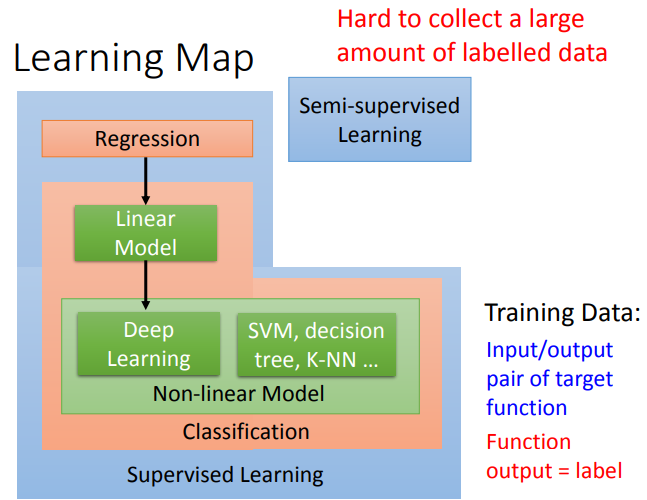

### 半监督学习(Semi-supervised Learning)

假如我们搭建一个识别猫和狗的系统，现在手头上有一些标记数据(Labelled Data)和一些未标记数据(Unlabelled Data)。半监督学习会利用这些未标记数据进行学习用以得到最好的函数。

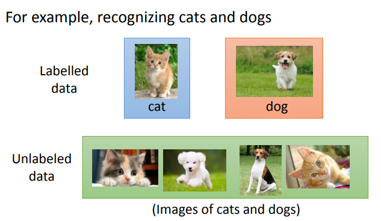

### 迁移学习(Transfer Learning)

还是搭建一个识别猫和狗的系统，手头上有一部分标记数据，一部分与猫狗没有关系的数据(比如式子老虎，标未标记都可)，迁移学习会利用这部分进行学习用以得到最好的函数。

### 无监督学习(Unsupervised Learning)

我们希望机器能够“无师自通”。

比如，要让机器学会阅读。我们没有告诉它每个词汇是什么意思，而是让它“看”大量文本。通过这大量的文本，它心中若有所感，逐渐有了自己的理解。

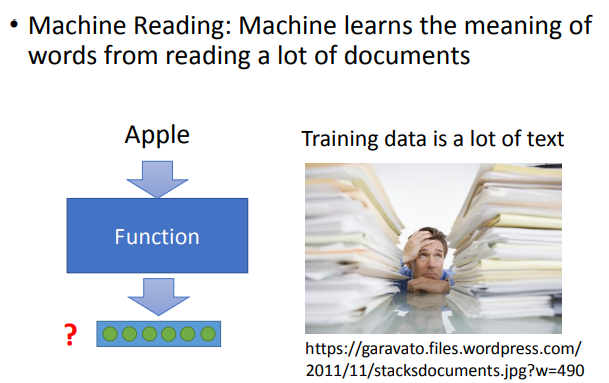

再比如，要让机器学会绘画。我们只给机器看大量的画作，机器需要自己从中学到一些东西。然后，自己开始动手作画。

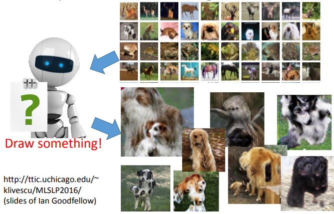

### 强化学习(Reinforcement Learning)

在监督学习中，我们会告诉机器正确答案是什么。假如要用监督学习的技术来训练一个聊天机器人，我们的训练方式可能是这样：

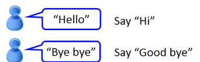

相当于有一个老师，告诉它该怎么回答。而在强化学习中，我们并没有告诉机器正确答案是什么，它只能得到一个分数，可以从中知道它做的好或不好。同样是训练聊天机器人，过程可能是这样：

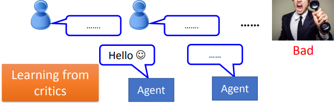

一开始，机器可能是在胡说八道，最后导致对方勃然大怒挂了电话，于是它知道自己做错事了，喀什反思。通过这样不断地尝试与反思，它慢慢提高了聊天水平。

让我们再回到一开始的图片

蓝色框表示的是学习的情景。通常学习的情景是没有办法控制的(取决于我们手头上有什么样的数据)，比如为什么我们要做强化学习呢？就是因为我们没有数据做监督学习才做强化学习。

橙色框表示的是要进行的任务。任务根据输出不同，有回归，分类，结构化学习(输出的东西是有结构的，比如说语言翻译，语音识别等等)等。不同的情景下都可能要进行这些任务。

绿色框表示的是任务可选择的方法。

总结如下：

>蓝色框代表情景，取决于有什么样的训练数据。

| 机器学习情景 | 训练数据类型         |
| ------------ | -------------------- |
| 监督学习     | 带有标签的数据       |
| 半监督学习   | 有部分带有标签的数据 |
| 无监督学习   | 无标签的数据         |
| 迁移学习     | 有一些不相干的数据   |
| 强化学习     | 只有评价             |

> 红色框代表任务，却决于函数输出是什么，可以放在以上五种学习情景的任一种内。

|机器学习任务|函数输出|
|--|--|
|回归|数值|
|分类|类别|
|结构化学习|有结构的内容|

>绿色框代表方法，可以放在任一学习任务中。

### 总结

当我们手头上有了一些数据后，就自然处于某种机器学习的情景下，比如：所有的数据都是带有标签的，就处于监督学习的情景下。我们之后会想用这些数据做一些任务以达到目的，比如回归，分类等等。在每种任务下，有很多种实现的方法，比如支持向量机，深度学习等。