回归(Regression)任务需要输出一个数值(Scalar)。比如

- 预测股价

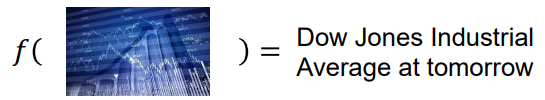

- 自动驾驶车

  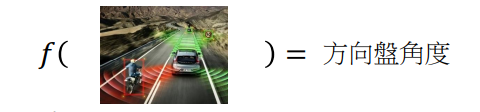

- 推荐系统

  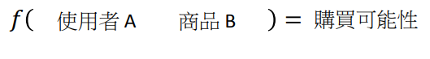

但我们并不想一开始就机器学习方法进行这么复杂的任务谈起，我们可以尝试做一个稍微有趣一些的任务——预测宝可梦进化后的CP(Combat Power，攻击力)值。

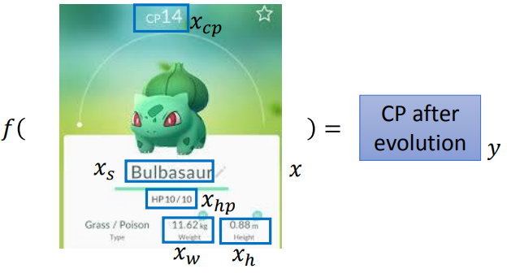

这里用

表示宝可梦的属性值，

表示标签值。具体来说，

表示进化前的CP值，

表示体重，

表示高度，

表示种类，

表示生命值。

## 第一步：设计模型(Model)

按照之前所学，机器学习第一步是定义一系列函数(设计模型)。比如我们可以将模型定为：

，它蕴含着无限个函数，比如

，

等等。

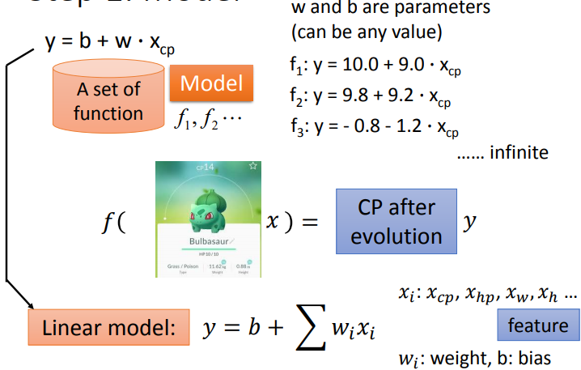

像

这类模型被称为线性模型(Linear model)，其中

代表属性，

代表权值，

称为偏置。

##第二步：定义函数好坏(Goodness of Function)

为了之后表达方便我们引进两个新符号，

表示第

个样例的属性值，

表示第

个样例的标签值。

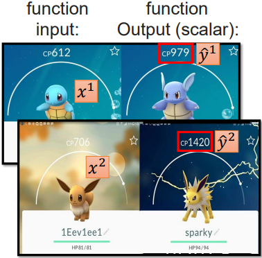

假设我们有10个样例数据，

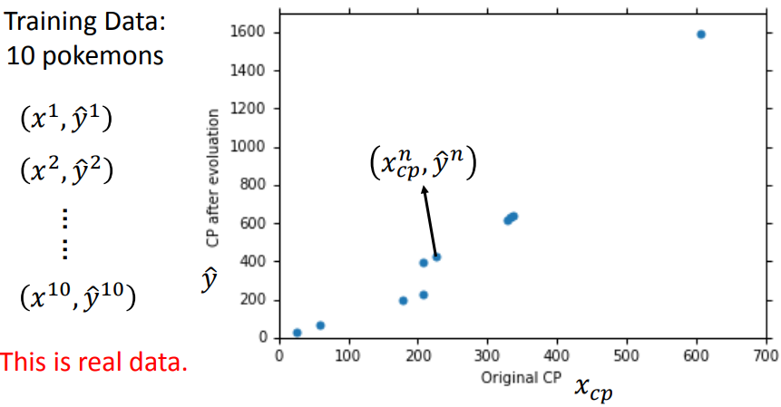

对于定义的模型下的函数，我们可以构造一个损失函数

以表达函数预测值

与真实标签值

之间的误差。

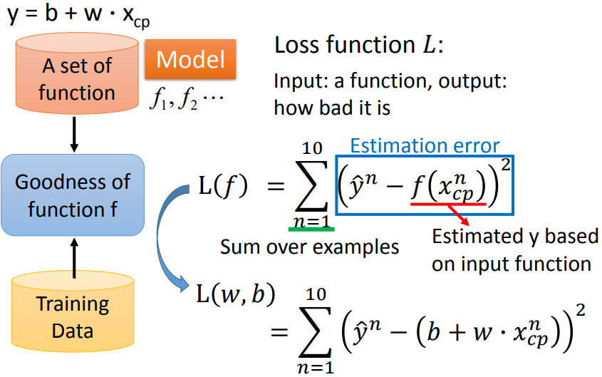

如上图所示，这里我们使用的损失函数为


即


对于不同的

和

，将10个样例数据代入

得到不同的损失值。

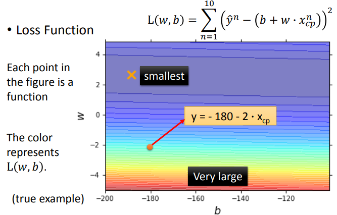

我们可以枚举

和

的可能取值，然后找到能使损失函数

取到最小取值的

和

，这样便可以确定模型中能使损失函数

取到最小值的最好函数

。但这种枚举的方法显然是很没有效率的，我们可以用更加高效的梯度下降(Gradient Descent)方法找到最好函数

。

## 第三步：选出最好的函数(Best Function)

在学习梯度下降方法之前，先捋一捋思路，我们的目标是找到

能使损失函数

取到最小值的最好函数

。

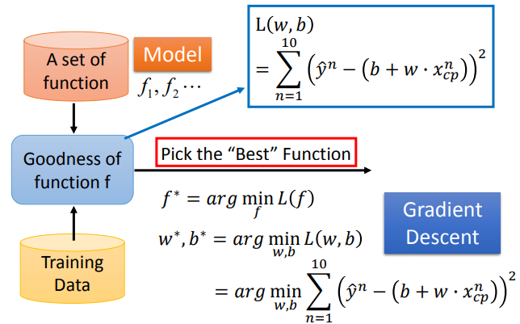

其实就是找到

对应的

和

。

### 梯度下降(Gradient Descent)

我们先考虑模型只有一个参数

的情况，

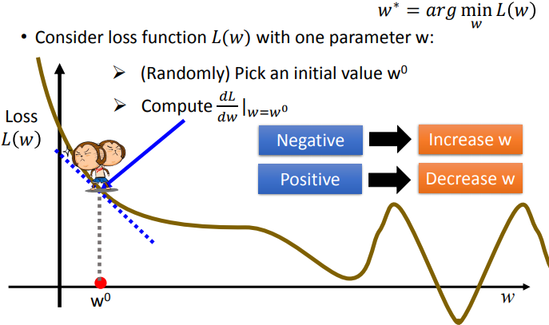

首先，随机选一个

的初始值

，然后计算

，若该值为负数，则要让

增大以减少

的值；若该值为正数，则要让

减小以减少

的值。由此，我们可以得到如下参数

的更新方式：

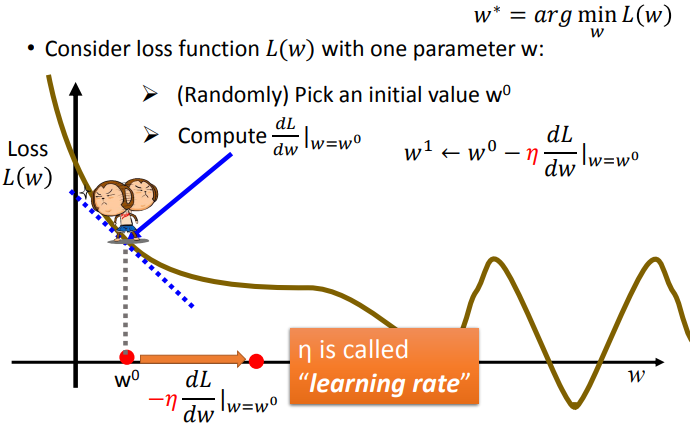

这里的

可以这么理解：它表示损失函数

在

处的变化率，即单位

能让

的变化量。

称为学习速率(Learning Rate)。

就表示

个单位

让

的变化量，前面加一个负号就可以不用再考虑

的正负。

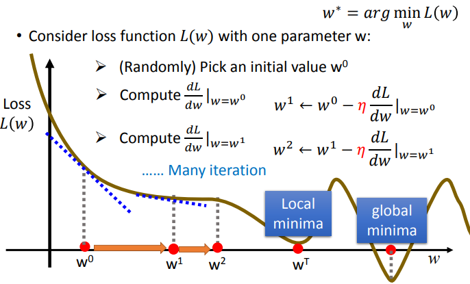

经过上图所示的多次迭代，就可以得到能使

取到全局最小或局部最小的

值。多个参数的过程是类似的，

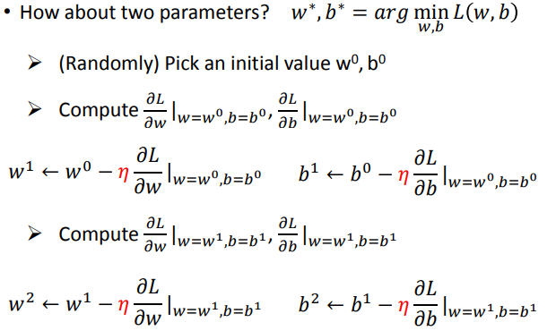

其中

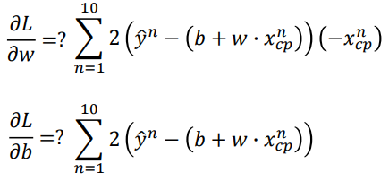

梯度(Gradient)：

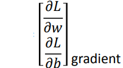

也就是梯度下降方法中梯度一词的由来。

那么经过多次迭代，损失函数

一定会取到全局最小值吗？不一定，比如出现下述情况：

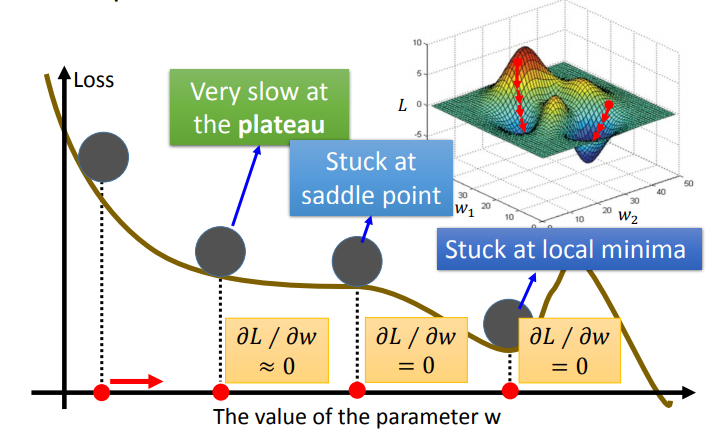

我们这里处理的损失函数是凸函数，它经过多次迭代后一定能取到全局最小值。

## 结果分析

通过使用梯度下降方法，我们得到了该模型下最好的函数：

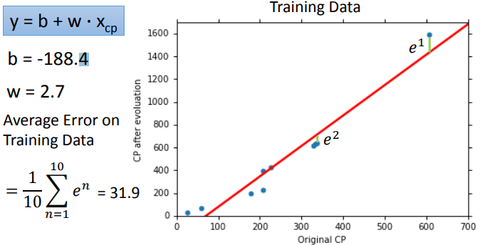

平均训练误差为31.9，但我们更加关心的是在测试集上的误差，因为它反映了模型的泛化能力。于是我们收集另外10个宝可梦作为测试集，得到的结果如下：

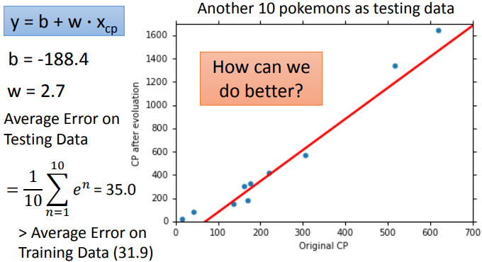

测试集上的平均误差比训练集上的误差大，那么问题来了，我们能做得更好吗？

于是设计另一个模型——增加二次项，也用梯度下降方法得到模型下最好的函数。

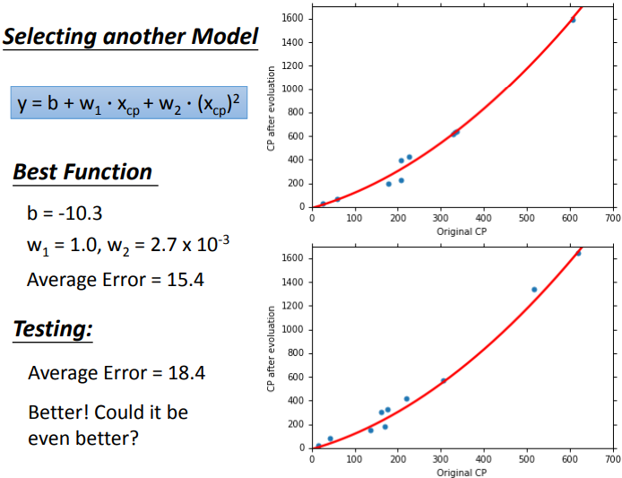

效果好一些。可以做得更好吗？我们给模型再增加三次项。

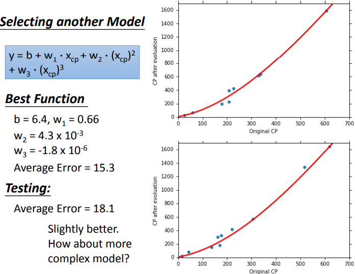

稍微好一些。那么更加复杂的模型呢？

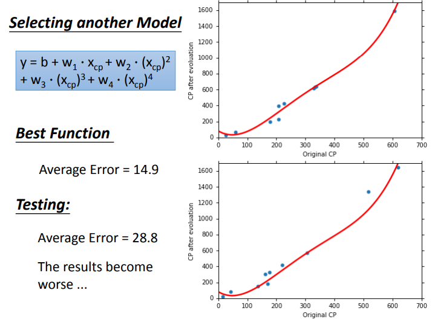

结果变糟了，但我们继续给模型增加五次项。

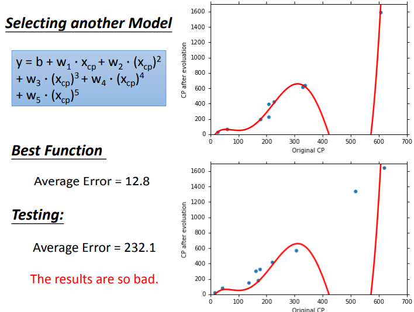

测试集上的平均误差“炸了”，远大于之前模型得到的测试集平均误差。

### 模型选择(Model Selection)

将训练集上的平均误差对比一下就可以发现，如果我们真的能找到每个模型下最好的函数，那么越复杂的模型下它的训练平均误差会越小。为什么会这样呢？下图可以给出一个解释，

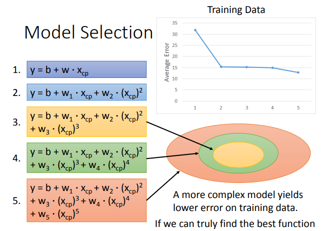

复杂模型的包含简单模型的函数集，比如将二次模型的二次项权重置为0，它就等同于一次模型。如果我们真的能找到每个模型下最好的函数，复杂模型下的最好函数的训练误差不一定会比简单模型下的的最好函数的训练误差小，但一定不会更大。那么对于上述的五个模型，我们应该选择哪个呢？答案是三次模型。

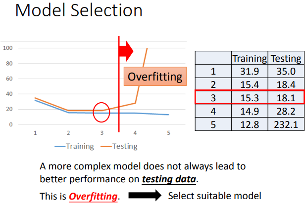

复杂模型在训练集上的表现会更好一些，但在测试集上表现越不会如此。可以看到，三次之后的模型的测试集平均误差骤增，远大于训练集平均误差，这就出现所谓的过拟合(Overfitting)现象。对应了那句“你把简单问题想复杂了”。我们收集更多的数据，

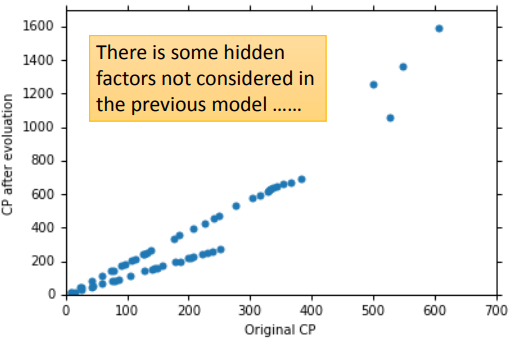

似乎有别的因素影响宝可梦进化后的CP值，是什么呢？——物种。

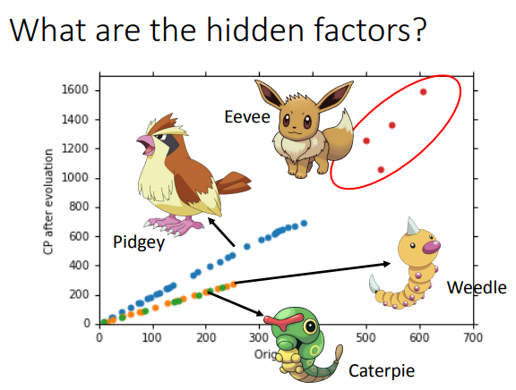

这个属性是我们之前的模型没有考虑到的，既然它对CP值有影响，所以我们有必要重新设计模型。

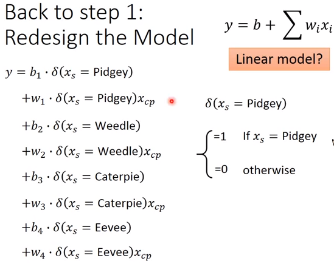

设计了上述新模型后，我们可以用梯度下降方法找到最好的函数。它在训练集和测试集上的表现如下：

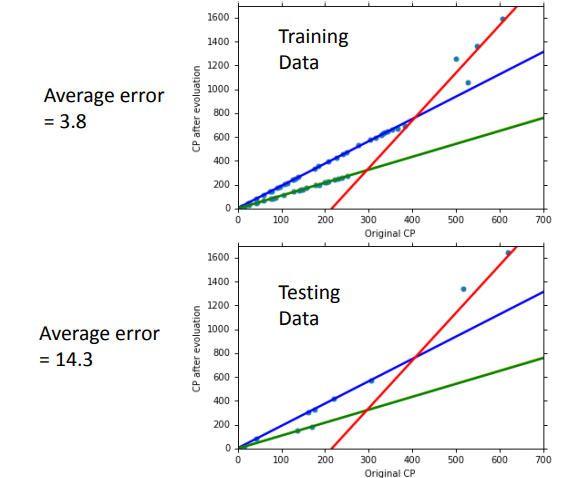

比之前的模型效果更好。考虑到宝可梦还有很多其它的属性，比如体重，血量，高度等等，我们可以设计更加复杂的模型：

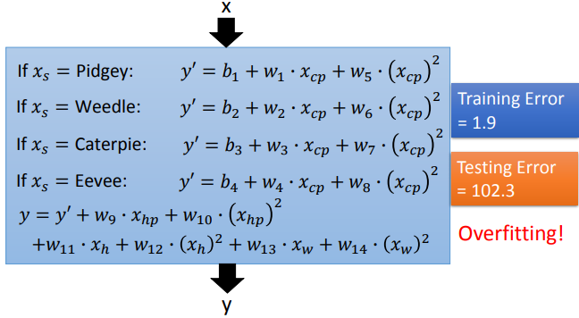

模型过拟合了。有什么办法应对模型过拟合问题吗？当然有，比如说——正则化(Regularization)。

### 正则化(Regularization)

可以给之前的损失函数增加一项

，称为正则项。

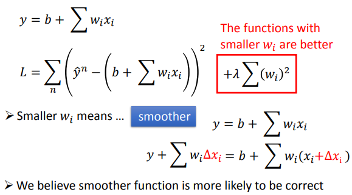

加入正则项是因为想让模型下的函数变得更加平滑一些，函数变得平滑的话，当从未见过的测试集上的

输入到函数中时，函数值不会应该数据集的变化而产生很大的变化，从而在测试集上的平均误差就可以有效地减少一些。其中，我们并没有将参数

加到正则项中，因为它对函数的平滑程度没有影响。

那么如何让函数变得平滑呢？

答案是让系数

增大。当

越大，就意味着我们越发需要考虑正则项对整体损失函数的影响，为了让整体损失函数值减小，权值

应该相应减小。权值

越小，函数自然变得更加平滑，从而达到目的。

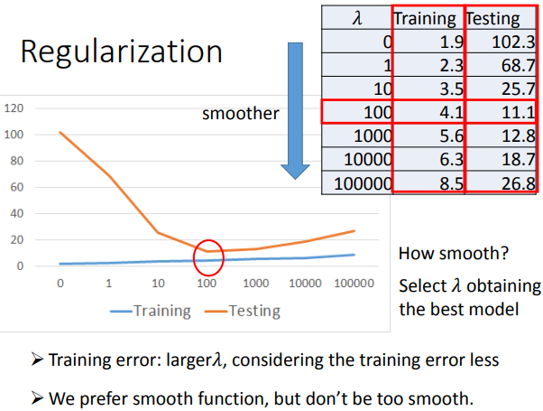


可以控制函数的平滑程度，但我们也不希望它太大，而是要选到合适值。如果太大，函数会变得很“佛系”(比如

的值都为0，函数变成

)，不管

怎么变，我就这样了，也就是对

太不敏感，这就会造成损失函数在训练集和测试集上的损失值变大。

## 示例

这里做一个简单的示例，我们将模型设计为：


误差函数为：


数据可以在[此处下载](https://www.openintro.org/book/statdata/index.php?data=pokemon)。

```python
import numpy as np
import pandas as pd
import matplotlib.pyplot as plt

df = pd.read_csv("pokemon.csv")
data = df[['cp', 'cp_new']].values
test_size = 0.33
epsilon = 0.001


def compute_error(b, w, points):
    """
    计算平均损失
    """
    x = points[:, 0]
    y = points[:, 1]
    return np.mean((y - (w * x + b))**2)


def step_gradient(b, w, points, learning_rate):
    """
    计算新的w和b的值
    """
    x = points[:, 0]
    y = points[:, 1]
    error = y - (w * x + b)
    b_gradient = 2 * np.mean(error)
    w_gradient = 2 * np.mean(error * (-x))
    b_new = b - (learning_rate * b_gradient)
    w_new = w - (learning_rate * w_gradient)
    return b_new, w_new


def main():
    train_data = data[:-int(test_size * len(data))]
    test_data = data[-int(test_size * len(data)):]
    plt.figure(figsize=(20, 10))
    plt.axis([0, 500, 0, 780])
    plt.ylabel("cp_new")
    plt.xlabel("cp")
    plt.scatter(train_data[:, 0], train_data[:, 1], label="train")
    plt.scatter(test_data[:, 0], test_data[:, 1], label='test')
    plt.legend()

    w = 0.0
    b = 0.0
    learning_rate = 0.00001
    x = np.arange(500)
    y = w * x + b
    for i in range(200):
        np.random.shuffle(data)
        train_data_ = data[:-int(0.1 * len(data))]
        test_data_ = data[-int(0.1 * len(data)):]
        train_error = compute_error(b, w, train_data_)
        test_error = compute_error(b, w, test_data_)
        print("{}. 训练平均误差:".format(i + 1), train_error, "测试平均误差:", test_error)
        if (train_error > epsilon):
            y = w * x + b
            b, w = step_gradient(b, w, train_data_, learning_rate)
            print("{}. w:{} b:{}".format(i + 1, w, b))
    print("测试平均误差:", compute_error(b, w, test_data))
    plt.plot(x, y)
    plt.show()


if __name__ == "__main__":
    main()
```

训练结果如下：

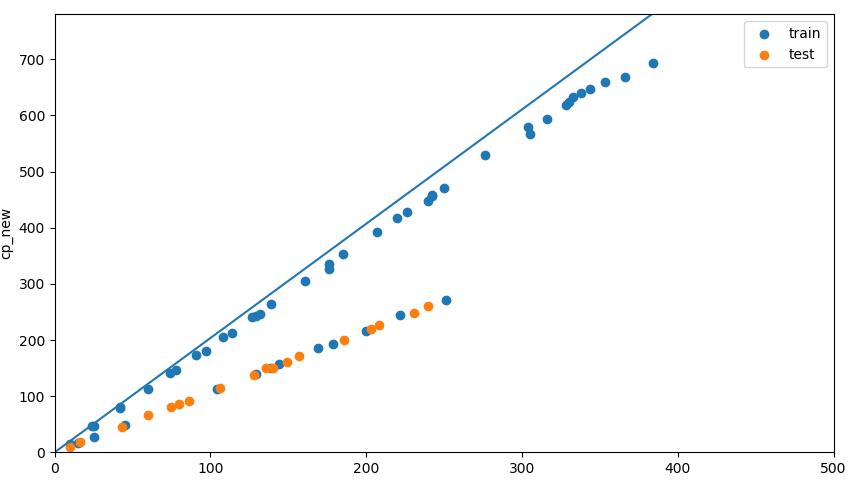

误差为：

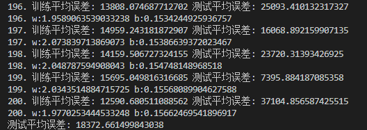

从结果上来看，模型还存在一些问题，但这个例子只是为了做个演示。

当然，[`sklearn.linear_model.LinearRegression`](https://scikit-learn.org/stable/modules/classes.html#module-sklearn.linear_model)也是方便好用的。

## 总结

本节我们进一步了解到机器的三个步骤，学习了机器学习中为解决回归这一任务的一种方法——线性模型。为了找到模型中最好的函数，我们使用了一种名为梯度下降的方法。然而设计的模型并不能万能的，它可能会出现各种问题，比如过拟合，我们可以尝试用正则化的技术解决它。