在上一节我们已经看到，更复杂的模型不一定会让其在测试集上的表现更好。

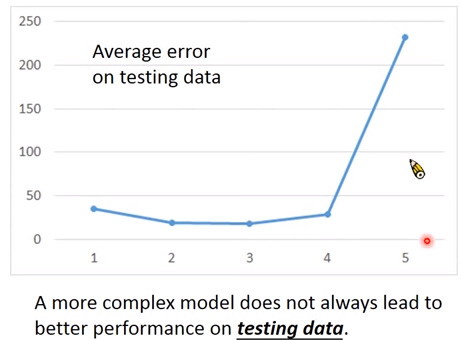

其实误差(Error)有两个来源，一个来自偏差(Bias)，一个来自方差(Variance)。了解这两个来源是大有裨益的，因为我们可以对得到的模型误差进行分析，看是来自偏差还是方差，然后用相应的方法解决，进而提高模型的性能。

对于宝可梦的例子而言，真实的函数$\hat{y}=\hat{f}\left ( x \right )$只有Niantic公司知道，我们通过训练数据找到的模型下的最好函数$f^*$是$\hat{f}$的一个估计值。

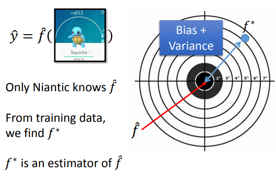

如上图所示，$\hat{f}$相当于靶心，我们得到的$f^*$与靶心之间的差距就是由于偏差和方差造成的。

## 估计值的偏差和方差

先看一个例子，估计变量$x$的均值和方差。

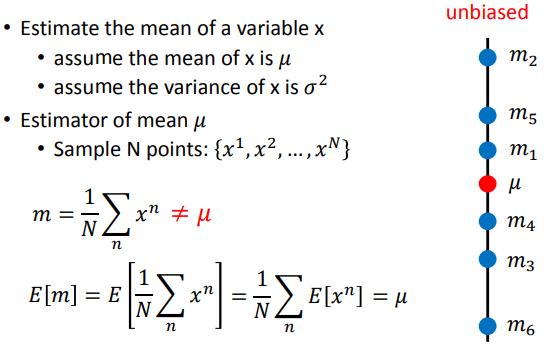

$m$代表的是一种估计方式，具体来说它等于$\frac{1}{N}\sum_{n}\left(x^n\right)$。对于宝可梦的例子而言，$m$相当于我们使用的模型。$m$的期望为$\mu$，意味着$m$这个估计量是无偏的。$\mu$相当于靶心，无偏的意思就是每次打靶的时候瞄准的是靶心而不是别的地方，尽管可能射击的时候没有打中靶心。计算$m$的方差，其值为$\frac{\sigma^2}{N}$，这意味着$N$越大，方差越小，$m$越接近$\mu$。

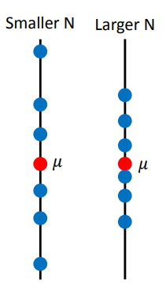

我们用如下估计量来估计方差：

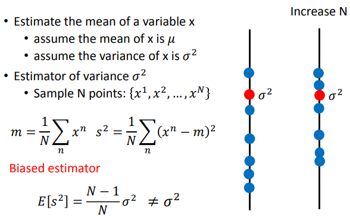

$s^2$的期望为$\frac{N-1}{N}\sigma^2$，不等于$\sigma^2$，说明$s^2$是有偏估计量。有偏的意思是这次我们瞄准的是$\frac{N-1}{N}\sigma^2$，而不是靶心$\sigma^2$。

现在回到宝可梦的例子，我们可以由训练数据得到多个该模型下的最好函数$f^*$。这是什么意思？什么叫多个最好函数？

比如，我们手上有1000个宝可梦数据，可以每次从中选取100个数据用来训练，这样进行10次。结束后，我们便可以得到10个该模型下的最好函数。

得到这些最好函数后，可以求其期望值$\bar{f}=E\left [f^* \right ]$。$\bar{f}$代表我们设计的模型在训练数据下瞄准的中心，它和靶心$\hat{f}$之间的差距就是偏差，而我们用训练数据得到的一个$f^*$与$\bar{f}$之间的差距就是方差。

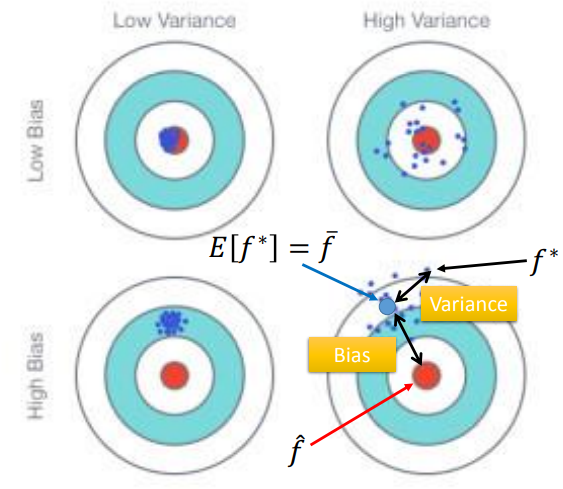

假设我们将宝可梦的选取100次，这样就可以得到100个$f^*$。

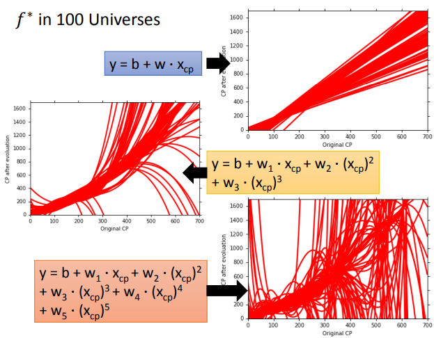

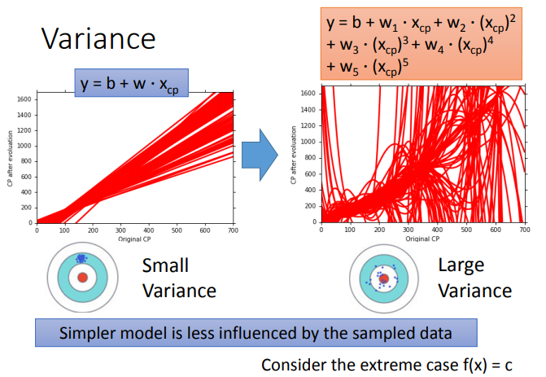

可以看到模型越复杂图像越乱，说明方差大；而模型越简单图像越一致，说明方差小。这说明简单模型不容易受样例数据的影响，例如$f(x)=c$，它就不会受到样例数据的影响。可以给所有的$f^*$求均值以观察偏差，

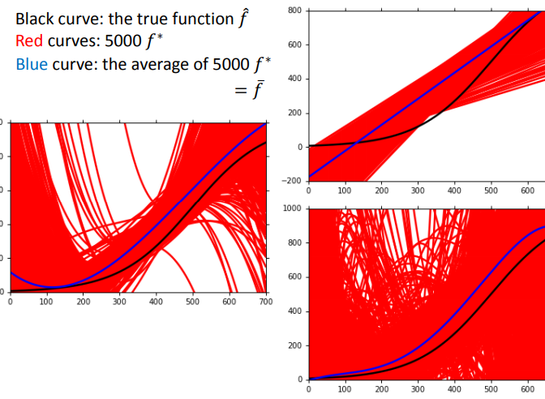

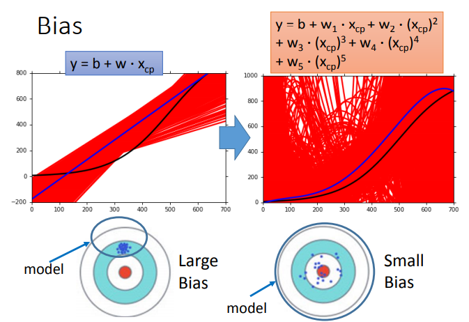

如果模型过于简单，它可能就没有覆盖到靶心位置，自然导致$\bar{f}$与$\hat{f}$相去甚远。

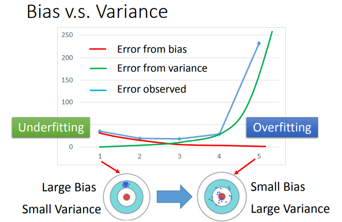

如上图所示，当模型过于简单时，模型的偏差大，方差小，会产生欠拟合现象；而当模型过于复杂时，模型的方差大，偏差小，会产生过拟合现象。

## 偏差大和方差大如何处理

如何判断模型到底是偏差大还是方差大呢？

- 若模型连训练样例都不能好好拟合，说明偏差大，模型过于简单，会产生欠拟合现象。
- 若模型能很好地拟合训练样例，但在测试集上有很大的误差，那就可能是方差大。

对于偏差大的模型，我们可以给当前模型添加更多的特征或者考虑更加复杂的模型。

对于方差大的模型，我们可以尝试用更多的训练数据或者正则化。

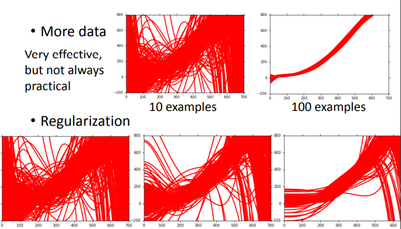

## 模型选择

在模型选择中通常有偏差和方差之间的权衡取舍，应选取介于二者之间的平衡点，以使得误差最小。

可以使用交叉验证的方式选模型：

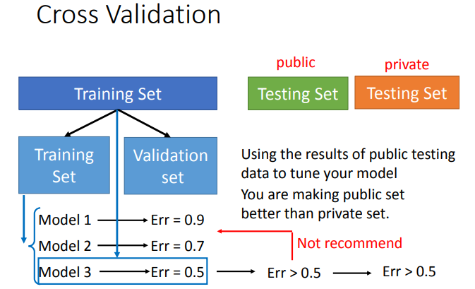

或者N折交叉验证：

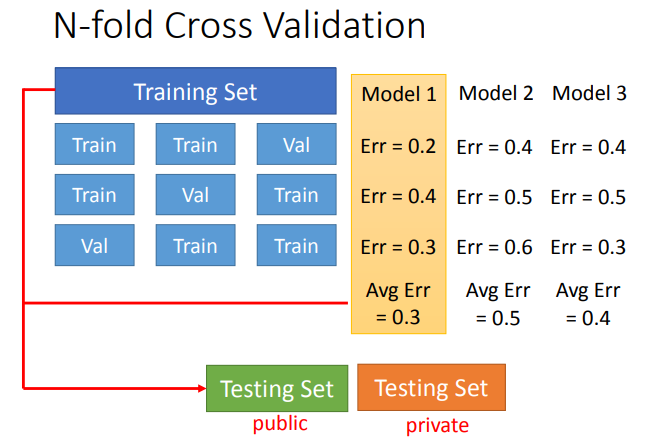

## 总结

本节我们了解了模型误差的来源——偏差和方法，学习了如何处理偏差或者方差大的模型以及如何进行模型选择。

## 推荐阅读

[Tutorial: Learning Curves for Machine Learning in Python](https://www.dataquest.io/blog/learning-curves-machine-learning/) [中译](https://www.jiqizhixin.com/articles/2018-01-23)