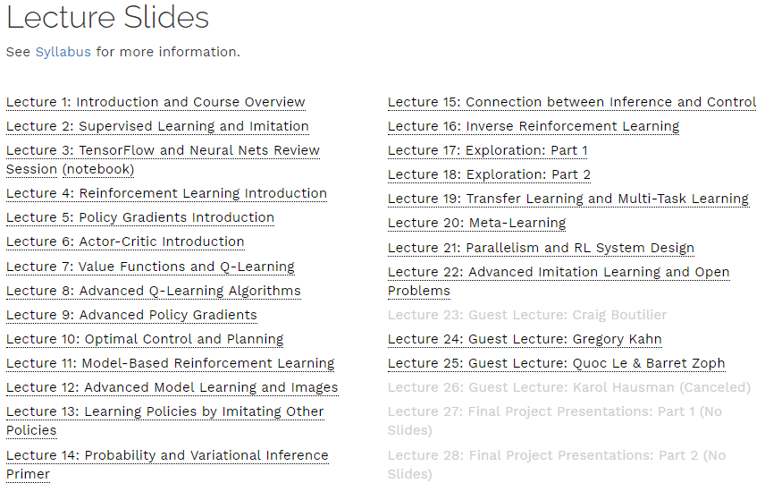

# AI-Learning
AI Learning

## Machine Learning (2020, Spring)

URL: http://speech.ee.ntu.edu.tw/~tlkagk/courses_ML20.html

| #                                                            | Notes                                                        | 作业说明                                                     | 作业示例                                                     |
| ------------------------------------------------------------ | ------------------------------------------------------------ | ------------------------------------------------------------ | ------------------------------------------------------------ |
| [Introduction](https://youtu.be/c9TwBeWAj_U) ([slide](http://speech.ee.ntu.edu.tw/~tlkagk/courses/ML2020/introduction.pdf)) | [1.引言](MachineLearning/1.引言.md) [2.学习导图](MachineLearning/2.学习导图.md) |                                                              |                                                              |
| [Regression](https://youtu.be/fegAeph9UaA) ([slide](http://speech.ee.ntu.edu.tw/~tlkagk/courses/ML2020/introduction.pdf)), [Basic Concept](https://youtu.be/D_S6y0Jm6dQ) ([slide](http://speech.ee.ntu.edu.tw/~tlkagk/courses/ML_2016/Lecture/Bias%20and%20Variance%20(v2).pdf)) | [3.回归](MachineLearning/3.回归.md) [4.误差](MachineLearning/4.误差.md) | [slide](https://docs.google.com/presentation/d/18MG1wSTTx8AentGnMfIRUp8ipo8bLpgAj16bJoqW-b0/edit#slide=id.g4cd6560e29_0_10) [video](https://youtu.be/QfU-qXINCvs) | [Regression](https://colab.research.google.com/drive/131sSqmrmWXfjFZ3jWSELl8cm0Ox5ah3C) [hw1](https://github.com/AndyFree96/AI-Learning/blob/master/MachineLearning/HWs/hw1/hw1.ipynb) |

## CS294-112 Deep Reinforcement Learning

URL: http://rail.eecs.berkeley.edu/deeprlcourse-fa18/

## MIT 6.S191 Introduction to Deep Learning

URL: http://introtodeeplearning.com/

## CS231n: Convolutional Neural Networks for Visual Recognition

URL: http://cs231n.stanford.edu/

## MIT 6.S094: Deep Learning for Self-Driving Cars

URL: https://selfdrivingcars.mit.edu/

## CSE 599W: Systems for ML

URL: http://dlsys.cs.washington.edu/
